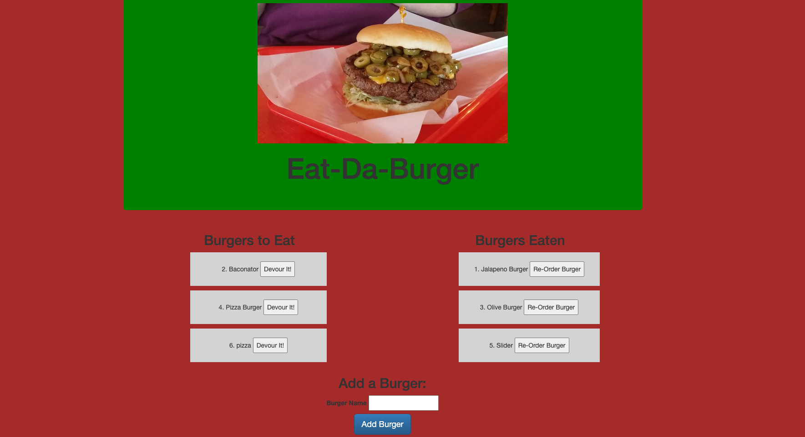

<h1 align="center">Unit 13 MVC: Burger Logger</h1>

## Node_Express_Handlebars

- [Description](#description)
- [Installation](#installation)
- [Usage](#usage)
- [Contributing](#contributing)
- [Questions](#questions)

## Description

This is a burger logger application that was built with MySQL, Node, Express, Handlebars and a homemade ORM. MVC design pattern was followed, Node and MySQL were used to query and route data, handlebars were used to general HTML.

The application allows a user to add a list of burgers they want to eat, after devouring a burger they will click a button and move it to the burgers eaten list and they will be given an opportunity to re-order that burger for future consumption.

Screenshot of the completed output:

My portfolio has been updated to include this project, and can be viewed at https://kvadou.github.io/Portfolio/portfolio.html

## Installation

`npm init`

`npm install mysql`

`npm install express`

`npm install express-handlebars`

## Usage

Run the following command at the root of the directory and you will be able to view the local website at http://localhost:8080/:

`node server.js`

The project was deployed on heroku and can viewed at this website:

`https://dry-lake-44353.herokuapp.com/`

## Contributing

:octocat: [Doug Kvamme](https://github.com/kvadou)

## Questions

Contact me with any questions: [email](mailto:dougkvamme@gmail.com) , [GitHub](https://github.com/kvadou) 
